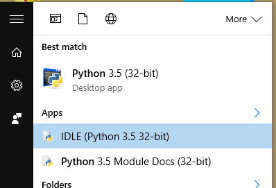
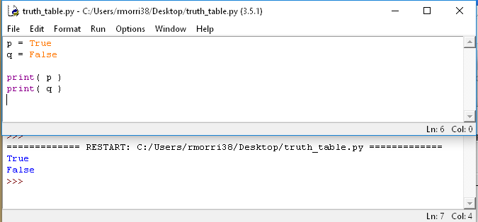
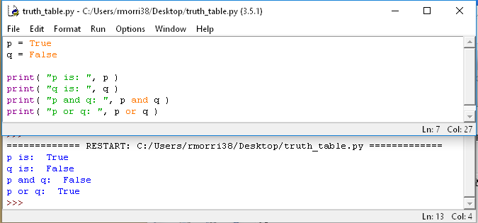
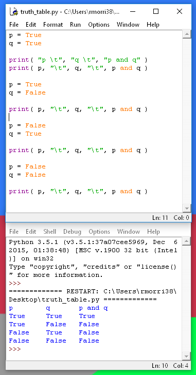
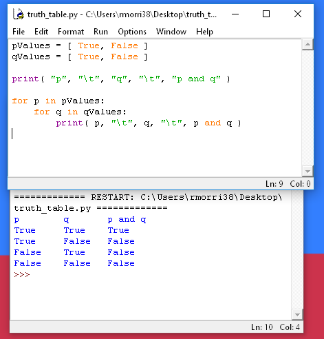
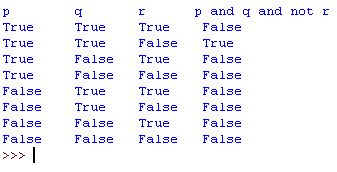

# Extra Credit - Truth Table Builder

This guide will step you through how to build a truth table builder
in Python.

You don't need previous Python experience, this will give you step-by-step instructions.

---

## Open IDLE

First, click on the Start menu and type in "Python". There should be an option that says IDLE. Select this program.

This will open the Python shell.

## Create a Python script

Within the shell, go to **File > New File**.

Save this new file on your computer somewhere (like the desktop) as "truth_table.py".

## Simple booleans

Let's start out with some simple booleans. In discrete math, we usually use *p* and *q* as the propositional variables, which will be either True or False.

In Python, you can create boolean variables like this:

	p = True
	q = False
	
and you can print the values of these variables like this:

	print( p )
	print( q )

Type this into your script, and go to **Run > Run Module** (or hit F5) and the program will run in the Python shell.

You can also use the keywords **and**, **or**, and **not** to combine propositions as well:

Source Code:

	p = True
	q = False
	
	print( "p is: ", p )
	print( "q is: ", q )
	print( "p and q: ", p and q )
	print( "p or q: ", p or q )

Therefore, if you wanted to write out a truth table that looked like this:

<table>
	<tr>
		<th>p</th>
		<th>q</th>
		<th>p ∧ q</th>
	</tr>

	<tr>
		<td>T</td>
		<td>T</td>
		<td>T</td>
	</tr>

	<tr>
		<td>T</td>
		<td>F</td>
		<td>F</td>
	</tr>

	<tr>
		<td>F</td>
		<td>T</td>
		<td>F</td>
	</tr>

	<tr>
		<td>F</td>
		<td>F</td>
		<td>F</td>
	</tr>
</table>

You could manually type it out in code like this:

Source Code:

	p = True
	q = True
	
	print( "p \t", "q \t", "p and q" )
	print( p, "\t", q, "\t", p and q )
	
	p = True
	q = False
	
	print( p, "\t", q, "\t", p and q )
	
	p = False
	q = True
	
	print( p, "\t", q, "\t", p and q )
	
	p = False
	q = False
	
	print( p, "\t", q, "\t", p and q )

But... it would be easier to use loops!

---

## Using loops to build a truth table

Let's store all possible values for *p* and for *q* in new variables - Lists. This will look like:

	pValues = [ True, False ]
	qValues = [ True, False ]

Then, we can use for loops to do T-T, T-F, F-T, and F-F automatically for us!
	
	for p in pValues:
	    for q in qValues:
	        print( p, "\t", q, "\t", p and q )

Then when the program runs it will look like this:

Now, you can use this program to solve all your truth tables! You just have to update *"p and q"* to say whatever the problem you're trying to solve is.

Sometimes, you will have to build truth tables with *three* propositional variables, and you can customize the program to look like this:

---

## Turn In

Upload your .py code file to the assignment dropbox
